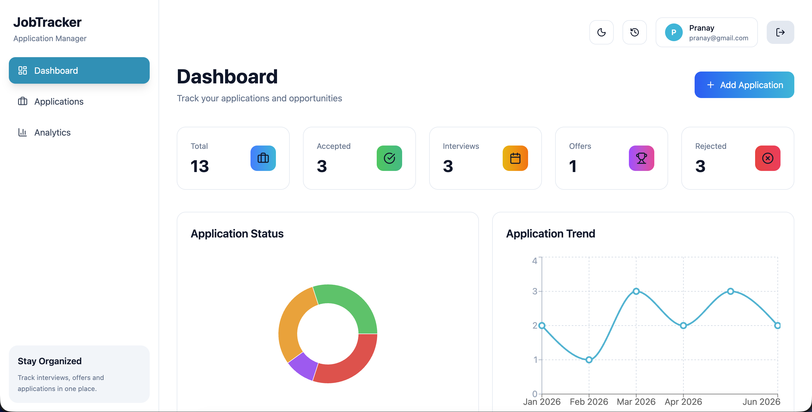
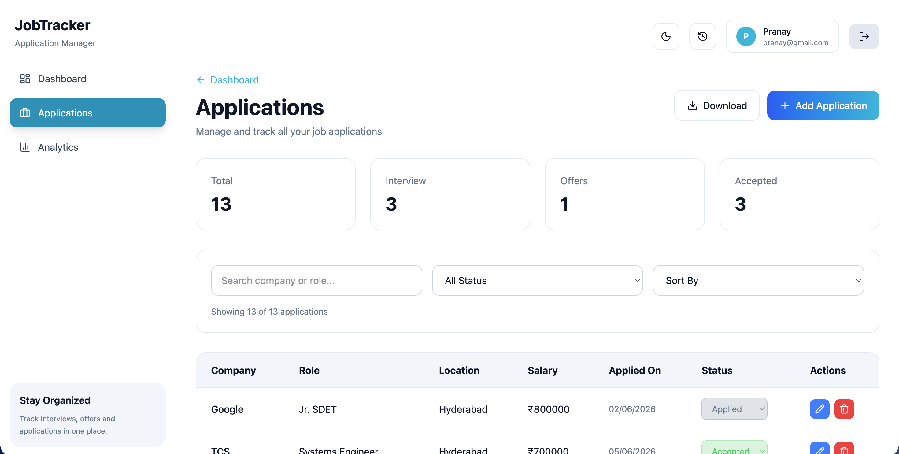
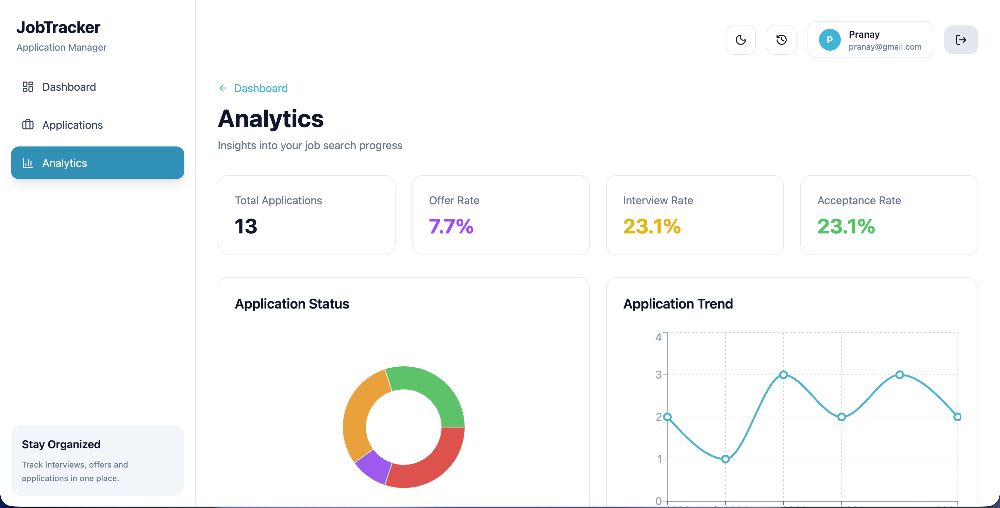

# Job Tracker

A full-stack job application tracking platform built with React, Flask, MongoDB Atlas, and JWT Authentication.

---

## Features

### Authentication

- User Registration
- User Login
- JWT Authentication
- Protected Routes
- Logout

### Dashboard

- Total Applications
- Interviews
- Offers
- Accepted Applications
- Recent Activity

### Application Management

- Create Applications
- Edit Applications
- Delete Applications
- Update Status
- Search Applications
- Filter Applications

### Analytics

- Application Trend Chart
- Status Distribution Chart
- Offer Rate
- Acceptance Rate
- Top Companies Applied

### Activity Tracking

- Recent Activity Dropdown
- Activity History
- Clear Activity Logs

### Export

- Export Applications as CSV
- Export Applications as JSON

### UI Features

- Responsive Design
- Dark Mode
- Modern Dashboard Layout

---

## Tech Stack

### Frontend

- React
- React Router
- Tailwind CSS
- Recharts
- Axios
- Lucide Icons

### Backend

- Flask
- Flask JWT Extended
- PyMongo
- Bcrypt

### Database

- MongoDB Atlas

---

## Screenshots

### Dashboard



### Applications



### Analytics



---

## Installation

### Backend

```bash
cd backend

python -m venv venv

source venv/bin/activate

pip install -r requirements.txt

python app.py
```

Backend runs on:

```text
http://127.0.0.1:5000
```

---

### Frontend

```bash
cd frontend

npm install

npm run dev
```

Frontend runs on:

```text
http://localhost:5173
```

---

## Environment Variables

Create:

```env
JWT_SECRET_KEY=your_secret_key
MONGO_URI=your_mongodb_connection_string
```

---

## Author

Pranay